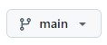

## Install
1. Open cmd
2. Check if you're in the main branch

4. Clone the repo: `git clone https://github.com/bluery0206/operate.git`.
5. Change directory `cd PATH\operate` after download. Change `PATH` to actual full path to `operate` folder.
6. Create python environment `py -m venv venv`
7. Activate environment `venv\scripts\activate`
8. Install all dependencies `pip install -r requirements.txt`
9. Create your own admin account `py manage.py createsuperuser`
10. Run server `py manage.py runserver`
11. Done

## Pull
1. Open cmd
2. Change directory `cd PATH\operate`. Change `PATH` to actual full path to `operate` folder.
3. Activate environment `venv\scripts\activate`
4. Pull `git pull`
5. Done

## Push
1. Open cmd
2. Change directory `cd PATH\operate`. Change `PATH` to actual full path to `operate` folder.
3. Activate environment `venv\scripts\activate`
4. Stage all changes `git add -A`
5. Commit all changes `git commit -m MESSAGE`. Change `MESSAGE` to atual message like what have changed.
6. Done
