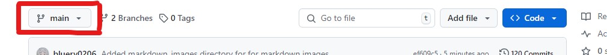
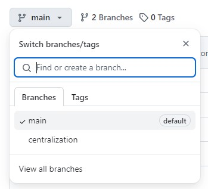

## Instructions

### Using Command Line (CMD)

#### Install
1. Download/Clone repository. Check if you're in the `main` branch
    
    If not, select `main`
    
2. Open cmd
3. Change directory `cd PATH` where `PATH` is your desired directory to download/clone the repository. e.g. `cd desktop`.
4. Clone the repository `git clone https://github.com/bluery0206/operate.git`.
5. Change directory `cd operate` after download, assuming that you haven't closed cmd after download.
6. Create python environment `py -m venv venv`
7. Activate environment `venv\scripts\activate`
8. Install all dependencies `pip install -r requirements.txt`
9. Create your own admin account `py manage.py createsuperuser`
10. Run server `py manage.py runserver`
11. Done

#### Pull
1. Activate environment. [More details here](#activate-python-environment)
4. Pull `git pull`
5. Done

#### Push
1. Activate environment. [More details here](#activate-python-environment)
4. Pull first to fetch changes if there's any `git pull`
5. Stage all changes `git add -A`
6. Commit all changes `git commit -m MESSAGE`. Change `MESSAGE` to atual message like what have changed.
7. Done

#### Activate Python Environment
1. Open cmd
2. Change directory `cd PATH\operate` where `PATH` is the actual full path to `operate` folder.
3. Activate environment `venv\scripts\activate`
